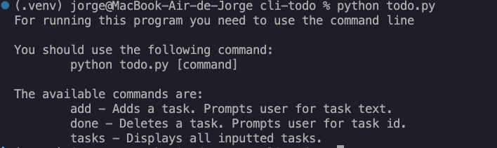
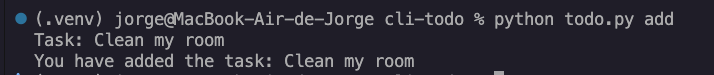
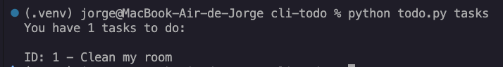
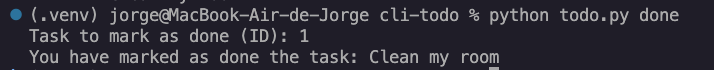

# CLI Todo App

A simple command-line Todo application built with Python. It allows users to add, view, and complete tasks directly from the terminal. Tasks are stored locally in a TXT file so they persist between sessions.

## Prerequisites

Before running the project, make sure you have:

- Python 3.10 or newer installed

To check your Python version:

```bash
python --version
```


## How to run the script

### Add a task

```bash
python todo.py add
```

### View all tasks

```bash
python todo.py tasks
```

### Mark a task as completed

```bash
python todo.py done 
```


## Screenshot showing the sample use of the script

### Menu



### Add task



### View Tasks



### Mark task as completed



## Features

- Add tasks
- View tasks
- Mark tasks as completed
- Store tasks in a local TXT file

## Author

**Jorge Valdez**

GitHub: [jorgevldzs](https://github.com/jorgevldzs)